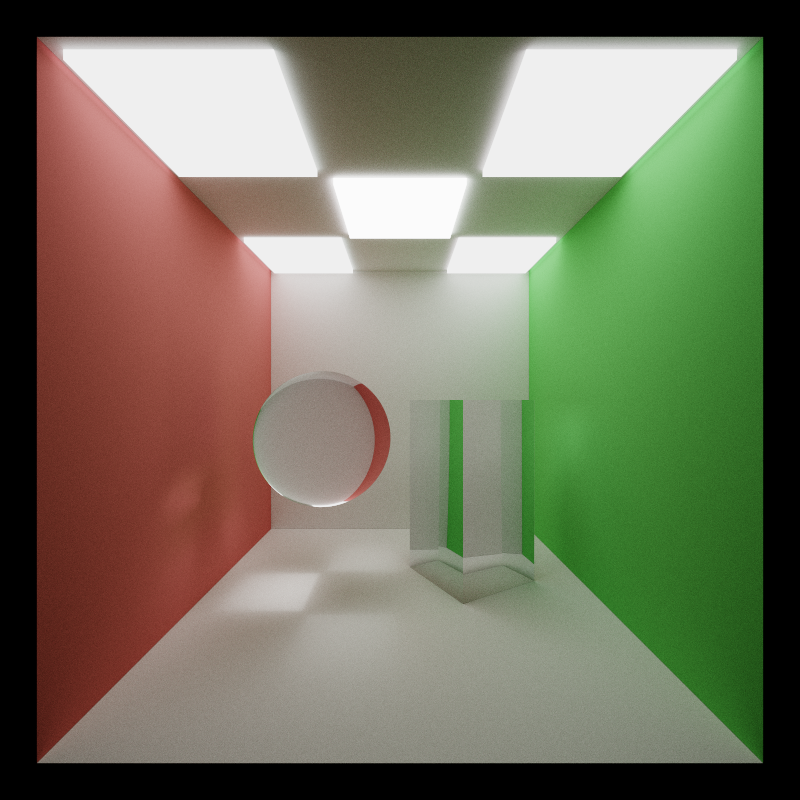
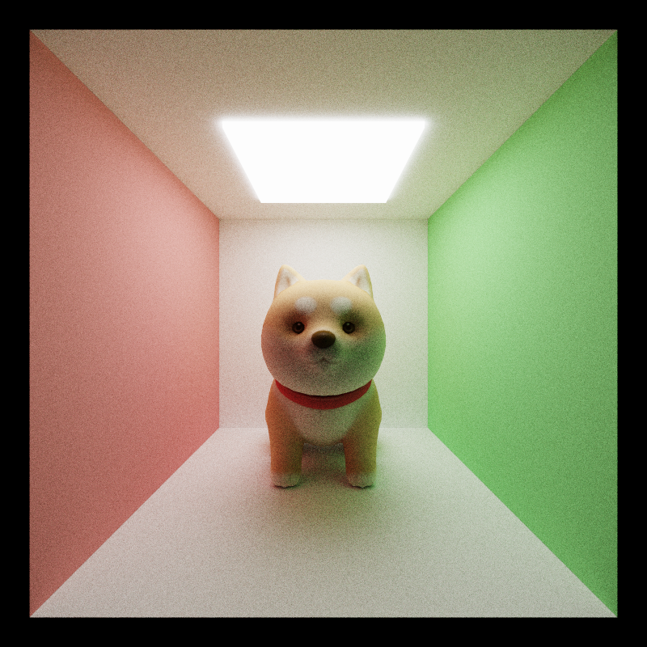

CUDA Path Tracer
================

**University of Pennsylvania, CIS 565: GPU Programming and Architecture, Project 2**

* Jichu Mao
  * [LinkedIn](https://www.linkedin.com/in/jichu-mao-a3a980226/)
  *  [Personal Website](https://jichu.art/)
* Tested on: Windows 11,  i7-13700K @ 3.40 GHz, 32GB, RTX 4090 24GB

## Overview

Welcome to the GPU Path Tracer, a high-efficiency ray tracing engine built on CUDA for optimal performance.

This implementation, rooted in Physically-Based Rendering (PBR), integrates seamlessly with glTF assets for mesh and material processing. It accurately simulates light behavior, delivering effects such as soft shadows, caustics, and depth of field.

By harnessing the parallelism of NVIDIA's CUDA API, the project accelerates complex computations, reducing rendering time while maintaining visual fidelity. It explores advanced CUDA kernel optimization, memory coalescence, and spatial data structures. With 5,000 path traces per frame and up to 8 bounces per ray, we ensure fast convergence to achieve high-quality, noise-free renders.

## Highlights

| Duck-Doggy-Duck (800*800 5000spp)|
| ------------------------------------ |
|          |

| The Dragon Beneath Starlit Skies (800*800 43200spp)|
| ------------------------------------ |
|          |

| Shanghai Nights (800*800 5000spp)|
| ------------------------------------ |
|          |

| Stone Cat Guardian (800*800 5000spp)|
| ------------------------------------ |
|          |

## Table of Contents
* [Highlights](#scenes)
* [Path Tracer Basics](#basic)
* Visual Features
	* [Material Shading(BSDFs)](#visual1)
	* [Stochastic Sampled Anti-Aliasing](#visual2)
	* [Physically-Based Depth of Field](#visual3)
	* [Arbitrary Mesh(glTF) Loading with Texture Mapping](#visual4)
	* [Support for Environment Map](#visual6)
    * [Tone Mapping and Gamma Correction](#visual7)
* Performance Improvements
	* [Stream Compaction](#perf1)
    * [Material Sorting](#perf2)
	* [Bounding Box Culling for glTF](#perf3)

* [Bloopers](#bloopers)
* [References](#references)

## <a name="basic">Path Tracer Basics</a>

A Path Tracer is a rendering engine that implements the [path tracing](https://en.wikipedia.org/wiki/Path_tracing) algorithm. It simulates the physics of light transport by tracing paths of light as they interact with surfaces in a 3D scene, capturing effects like global illumination, soft shadows, and caustics. This project implements a GPU-accelerated Path Tracer using CUDA, enabling efficient parallel computation and high-quality photorealistic rendering.

At the heart of path tracing is [the Light Transport Equation](https://pbr-book.org/3ed-2018/Light_Transport_I_Surface_Reflection/The_Light_Transport_Equation) (also known as the Rendering Equation), which governs how light moves and interacts with objects in the scene. The Path Tracer solves this equation by simulating the behavior of light rays, calculating how they bounce off surfaces and accumulate light. The equation describes both direct and indirect illumination, capturing realistic effects such as reflections, refractions, and diffuse scattering.

The Light Transport Equation is formulated as:

#### Lo(p, &#969;o) = Le(p, &#969;o) + &#8747;S f(p, &#969;o, &#969;i) Li(p, &#969;i) V(p', p) |dot(&#969;i, N)| _d_&#969;i

By simulating the light transport and solving this equation for every pixel, the Path Tracer generates highly realistic images with accurate lighting effects.

A Path Tracer works by approximating the solution to the Light Transport Equation through a technique called path tracing. The core idea of path tracing is to simulate the paths that light rays take as they travel through a scene, bouncing off surfaces and interacting with materials.

The basic workflow of a Path Tracer can be summarized as follows:

1. **Ray Casting**: Rays are cast from the camera through each pixel into the 3D scene.
2. **Ray-Surface Interactions**: For each ray, the algorithm determines where it intersects with surfaces in the scene. This intersection point is where the light's behavior is computed.
3. **Light Scattering**: At each intersection, the path tracer calculates how the incoming light is reflected or refracted, depending on the surface's material properties (defined by the BRDF). The light is then scattered in random directions.
4. **Recursive Path Tracing**: The ray continues bouncing until it reaches a light source or is absorbed by the surface. Each bounce contributes to the pixel's final color by accumulating light from multiple paths.
5. **Monte Carlo Integration**: To solve the rendering equation, path tracing relies on random sampling of light paths, which are averaged over multiple iterations. This statistical method, known as Monte Carlo integration, helps approximate the final image by converging to the correct solution over time.

By repeating this process for thousands of rays per pixel, the Path Tracer generates an image that gradually converges to a high-quality, realistic result, capturing complex lighting effects such as global illumination, caustics, and depth of field. 

The images below show the difference between the path tracer and real-world ray bounces.
|||
|:--:|:--:|
| *How Light Bounces in a Path Tracer* | *How Light Bounces in Real-world* |

# Visual Features

This path tracer incorporates several key features to ensure that the rendered images are physically accurate, capturing realistic lighting and material behavior.

## <a name="visual1"> Material Shading(BSDFs)</a>

The BSDF describes how light interacts with a surface, dictating how rays of light are scattered when they strike different materials. It’s a crucial component in physically-based rendering (PBR), as it helps simulate real-world material properties.

In this path tracer, several BSDFs have been implemented to handle a range of material types:

- **Diffuse**: Represents perfectly matte surfaces, where light scatters uniformly in all directions.
- **Partially Diffuse & Specular**: Represents materials that exhibit a mix of diffuse and specular reflection, such as glossy surfaces.
- **Perfectly Specular**: Models mirror-like surfaces, where light reflects in a single direction based on the angle of incidence.
- **Refractive**: Models transparent materials like glass or water, where light is refracted and bent as it passes through the surface.

These BSDFs allow the path tracer to accurately simulate a variety of materials, from rough matte objects to shiny, reflective, or transparent surfaces, making the renders look physically realistic.

 |  |  |
|:--:|:--:|
| *Diffuse* | *Partially Diffuse & Specular* |

  | |
|:--:|:--:|
| *Perfectly Specular* |  *Refractive* |

## <a name="visual2"> Stochastic Sampled Anti-Aliasing</a>

**Aliasing** refers to the visual distortion that causes jagged edges in images, especially along the borders of objects. In path tracing, this can occur when rays are deterministically cast from the camera to each pixel, always hitting the same geometry. The result is a "stepped" appearance in edges, making them look unnaturally sharp and jagged.

To counter this, [**Stochastic Sampled Anti-Aliasing**](https://paulbourke.net/miscellaneous/raytracing/) is used. Instead of casting rays from the same point on each pixel in every iteration, this method introduces randomness by slightly "jittering" the ray’s origin within the pixel area using [**Stratified Sampling**](https://pbr-book.org/3ed-2018/Sampling_and_Reconstruction/Stratified_Sampling). This jittering means that, on each iteration, rays sample different points within the pixel, ensuring that the edges are sampled more evenly over time.

As these random samples accumulate across multiple iterations, the averaged result produces smooth, anti-aliased edges, giving the final image a clean, natural appearance. This feature can be easily toggled ON/OFF using the preprocessor directive `ANTI_ALIASING` in the `utilities.h` file.

  | |
|:--:|:--:|
| `ANTI_ALIASING` OFF |  `ANTI_ALIASING` ON |

## <a name="visual3"> Physically-Based Depth of Field</a>

To simulate Depth of Field (DOF), [a thin-lens camera model](https://pbr-book.org/3ed-2018/Camera_Models/Projective_Camera_Models#TheThinLensModelandDepthofField) is used, which replicates how real cameras behave with finite-sized apertures. In this implementation, DOF is controlled by two key parameters: **Lens Radius (aperture size)** and **Focal Length (focal distance)**.

- **Lens Radius** controls the amount of blur for objects not on the focal plane. A smaller radius approximates a pinhole camera, producing sharp images, while a larger radius increases the blur for out-of-focus areas.

- **Focal Length** determines the distance from the camera at which objects appear in sharp focus. Objects closer or farther from this point appear progressively blurrier.
The DOF effect is achieved by first determining the focal point based on the Focal Length, then adjusting the ray's origin by sampling random points on the lens (based on the Lens Radius), and recalculating the ray direction toward the focal point.

To show the DOF results, two experiments were conducted:

- Fixed Focal Length 9.0, varying Lens Radius (0, 0.5, 1.0) to observe the effect of aperture size.

<table>
  <tr>
    <td align="center"><b>Lens Radius = 0.0</b></td>
    <td align="center"><b>Lens Radius = 0.5</b></td>
    <td align="center"><b>Lens Radius = 1.0</b></td>
  </tr>
  <tr>
    <td></td>
    <td></td>
    <td></td>
  </tr>
  <tr>
    <td colspan="3" align="center"><i>Lens Radius = 0.1, Trace Depth = 8, 5000ssp </i></td>
  </tr>
</table>  

- Fixed Lens Radius 0.1, varying Focal Length (5, 8, 15) to observe how changing the focus distance impacts the image sharpness.

<table>
  <tr>
    <td align="center"><b>Focal Length = 5.0</b></td>
    <td align="center"><b>Focal Length = 8.0</b></td>
    <td align="center"><b>Focal Length = 15.0</b></td>
  </tr>
  <tr>
    <td></td>
    <td></td>
    <td></td>
  </tr>
  <tr>
    <td colspan="3" align="center"><i>Focal Length = 9.0, Trace Depth = 8, 5000ssp </i></td>
  </tr>
</table>  

This approach allows for realistic DOF rendering, simulating how light behaves when passing through a real lens, and can be toggled using the`DEPTH_OF_FIELD` preprocessor directive.

## <a name="visual4"> Arbitrary Mesh(glTF) Loading with Texture Mapping</a>

To enhance scene complexity and visual fidelity, this path tracer supports robust loading of arbitrary meshes using the widely-adopted [**glTF**](https://www.khronos.org/Gltf) format. glTF is known for its efficiency in defining 3D models, animations, and scenes, making it ideal for modern graphics applications.

In this project, [**TinyGLTF**](https://github.com/syoyo/tinygltf) is used to parse glTF and GLB files, extracting mesh data such as vertex positions, normals, UVs, and indices. Since these libraries are not GPU-compatible, custom data structures were implemented to store the mesh information. Vertex data is consolidated into a single buffer, similar to the way **Vertex Buffer Objects (VBOs)** are structured in OpenGL. This ensures efficient data transmission to the GPU for rendering.

To ensure accurate shading, [**Barycentric Interpolation**](https://www.scratchapixel.com/lessons/3d-basic-rendering/ray-tracing-rendering-a-triangle/barycentric-coordinates.html) is employed to interpolate vertex normals and UVs, allowing for smooth texture mapping and lighting across the surface of the mesh. This technique helps replicate the **Primitive Assembly** step of a traditional graphics pipeline, which is absent in this CPU-GPU hybrid path tracer.

|  | &rarr;|  | &rarr;|  |
|:--:|:--:|:--:|:--:|:--:|
| *Model without Texture* |&rarr;| *Apply the Texture* |&rarr;| *Texture Sampled by Interpolated UVs* |

One challenge with supporting high-poly models is the computational cost of ray-triangle intersection tests, especially when processing models with a large number of triangles. To optimize performance, **Bounding Volume Intersection Culling** is employed, significantly reducing the number of triangles tested during rendering. This ensures that complex models can be loaded and rendered efficiently without compromising the path tracer's performance.

## <a name="visual6"> Support for Environment Map</a>

An [Environment Map](https://en.wikipedia.org/wiki/Reflection_mapping) provides a 360-degree representation of the scene's surroundings, often using [HDR (High Dynamic Range)](https://en.wikipedia.org/wiki/High_dynamic_range) images to capture a wide range of lighting information. In this CUDA-based path tracer, the environment map is used to sample lighting when rays do not intersect with any objects, simulating outdoor lighting and reflections.

To efficiently sample the environment map, this project utilizes `cudaTextureObject_t` for texture lookup. The environment map is loaded as an HDR texture, and when rays miss all objects, the texture object is sampled to return the corresponding color based on the ray direction. This ensures realistic lighting and reflections from the environment, enhancing the overall image realism.

The walls of the Cornell Box in the following scene are all transmissive, while the metal sphere in the center is a completely specular reflective material. You can see that when the Environment Map is not turned on, there is no light in the scene except for the only light. When Environment Map is turned on, the walls are transmissive and the sphere specularly reflects the light behind the lens.

This feature can be easily toggled ON and OFF using the preprocessor directive `ENVIRONMENT_MAP_ENABLED` in the `utilities.h` file.

  | |
|:--:|:--:|
| `ENVIRONMENT_MAP_ENABLED` OFF |  `ENVIRONMENT_MAP_ENABLED` ON |

## <a name="visual7"> Tone Mapping and Gamma Correction</a>

In this project, I implemented the ACES and Reinhard Tonemapping methods, as well as Gamma Correction.

[Tone Mapping](https://en.wikipedia.org/wiki/Tone_mapping) is a process used to map high dynamic range (HDR) values to a lower dynamic range that output devices can display, preserving image details in highlights and shadows.

[ACES(Academy Color Encoding System)](https://en.wikipedia.org/wiki/Academy_Color_Encoding_System) is a color management framework designed to maintain color accuracy across different devices and formats, particularly in film production. It transforms high dynamic range and wide color gamut data into a manageable range for display or final output.

`ACES: color.rgb = (color.rgb * (2.51 * color.rgb + 0.03)) / (color.rgb * (2.43 * color.rgb + 0.59) + 0.14)`

[Reinhard Tone Mapping](https://64.github.io/tonemapping/) is a simple tone mapping technique that compresses HDR values to a lower range by scaling based on the brightness of each pixel. It avoids oversaturation in highlights.

`Reinhard: color.rgb = color.rgb / (1 + color.rgb)`

|  |  | |
|:--:|:--:|:--:|
| No Tone Mapping| Reinhard |ACES|

[Gamma Correction](https://en.wikipedia.org/wiki/Gamma_correction)  adjusts the relationship between a pixel's input value and its displayed brightness, ensuring that the image appears correctly to the human eye, compensating for non-linear display behavior.

`Gamma Correction: color.rgb = pow(color.rgb, 1 / 2.2)`

|  |  |
|:--:|:--:|
| No Gamma Correction | With Gamma Correction|

These features can be easily toggled ON and OFF using the preprocessor directive `ACES_TONE_MAPPING` `REINHARD_TONE_MAPPING` `GAMMA_CORRECTION` in the `utilities.h` file.

# Performance Improvements

## <a name="perf1"> Stream Compaction</a>

**Stream compaction** is an essential optimization technique in GPU-based path tracers, as demonstrated by the provided benchmarks. The goal is to remove inactive rays—those that have either hit a light source, escaped the scene, or reached the maximum trace depth—thereby reducing the number of rays processed in subsequent kernel launches.

From the graphs, it is clear that stream compaction offers significant performance improvements, particularly in open scenes where rays are more likely to exit the scene early. **The Figure 1** comparing baseline to stream compaction shows that with each increasing trace depth, the number of remaining rays in the compaction-enabled case is significantly lower than in the baseline, reflecting the early termination of rays.

*Figure 1: Stream Compaction Performance in Open Scene*

In closed scenes, as seen in **the figure 2**, the performance gains are less pronounced because rays tend to bounce more within the enclosed environment, causing fewer terminations. 

*Figure 2: Stream Compaction Performance in Closed Scene*

However, **the figure 3** shows that even in these scenarios, there is a slight reduction in rendering time when stream compaction is applied, albeit smaller than in open scenes.

Overall, stream compaction optimizes GPU resource usage by reducing memory access and improving warp efficiency. As indicated by the third chart, it reduces rendering times from 25.7 ms to 18.2 ms in open scenes, representing a substantial improvement. However, in closed scenes, the reduction is less significant, from 45.2 ms to 44.1 ms, due to fewer rays terminating early.

*Figure 3: Rendering Time Comparison between Baseline and Stream Compaction*

## <a name="perf2"> Material Sorting</a>

**Material sorting** is another optimization that attempts to improve path tracer performance by grouping rays based on the materials they interact with. The intention is to reduce warp divergence during shading operations, as different materials take varying amounts of time to compute.

However, as shown in **the figure 4**, material sorting in this case introduces substantial overhead without any significant performance gains. Across scenes with different numbers of materials, sorting appears to degrade performance rather than improve it. For instance, in the simplest case with one material, the frame rate drops from 52 FPS (baseline) to 22 FPS after sorting. As the number of materials increases, the sorting overhead persists without offering compensatory benefits, suggesting that in these scenes, warp divergence due to material differences is not a significant bottleneck.

*Figure 4: Material Sorting Impact on Performance with Different Material Counts*

This suggests that material sorting may not be suitable for smaller or simpler scenes where the cost of sorting outweighs any potential improvements. It could prove more useful in more complex scenes with a wider variety of materials and highly divergent shading calculations.

## <a name="perf3"> Bounding Box Culling for glTF</a>

**Bounding box culling** is applied during mesh intersection tests to reduce the number of triangle checks performed by rays. Axis-Aligned Bounding Boxes (AABB) are computed for each mesh, and rays are only tested for intersection with the individual triangles if they first intersect the bounding box.

**The figure 5** illustrates the performance benefits of bounding box culling. For models with fewer triangles (e.g., 575 or 1345), the culling improves the average frame rate by a noticeable margin. The average frame rate increases from about 13 FPS to 15 FPS for a model with 575 triangles and remains consistently beneficial up to models with 2212 triangles.

*Figure 5: Bounding Box Culling Performance with Varying Triangle Counts*

However, as the number of triangles increases, the performance gains start to taper off. For high-poly models (4098 triangles or more), bounding box culling provides less of an advantage, as the probability of rays intersecting the bounding box becomes higher. In these cases, most of the ray tests still need to check the individual triangles, leading to diminishing returns in performance.

Nevertheless, bounding box culling proves to be a highly effective optimization for low- to mid-poly models, offering performance gains between 20% and 40% depending on scene complexity and triangle count.

## <a name="bloopers">Bloopers!</a>
**The Duck with Unevenly Applied "Cream"**

 _* The sun brightness in the HDR environment map is too high, and the lack of multiple importance sampling in the code makes image convergence difficult *_

**The Agent Dog Traversing Across Dimensions**

 _* Transformation matrix and camera setup misconfigured *_

## <a name="references">References</a>
* Assets
    * [glTF Sample Models(Models)](https://github.com/KhronosGroup/glTF-Sample-Models/tree/master/2.0)
    * [Sketchfab(Models)](https://sketchfab.com/)
    * [Poly Haven(HDR Maps& Models)](https://polyhaven.com/)
    * [HDRI-HAVEN(HDR Maps)](https://hdri-haven.com/)
* Implementations
    * Material Shading: [BSDFs](https://pbr-book.org/3ed-2018/Materials/BSDFs#BSDF), [Reflective Models](https://pbr-book.org/3ed-2018/Reflection_Models), [GPU Gems 3, Chapter 20](https://developer.nvidia.com/gpugems/gpugems3/part-iii-rendering/chapter-20-gpu-based-importance-sampling)
    * Stochastic Sampled Anti-Aliasing: [Paul Bourke's Raytracing Notes](https://paulbourke.net/miscellaneous/raytracing/#:~:text=Stochastic%20Sampling&text=The%20method%20antialiases%20scenes%20through,a%20preset%20number%20of%20cells.)
    * Steam Compaction: [CIS 5650 Project 2 @UPenn](https://cis5650-fall-2024.github.io/) , [GPU Gems 3, Chapter 39](https://developer.nvidia.com/gpugems/gpugems3/part-vi-gpu-computing/chapter-39-parallel-prefix-sum-scan-cuda)
    * Depth of Field: [The Thin Lens Model and Depth of Field](https://www.pbr-book.org/3ed-2018/Camera_Models/Projective_Camera_Models#TheThinLensModelandDepthofField)
    * glTF Mesh Loading: [Github Repo of tinygltf](https://github.com/syoyo/tinygltf/), [Official glTF Tutorials](https://github.com/KhronosGroup/glTF-Tutorials/)
    * Tone Mapping&Gamma Correciton: [The Evolution Theory of Tone Mapping](https://zhuanlan.zhihu.com/p/21983679)